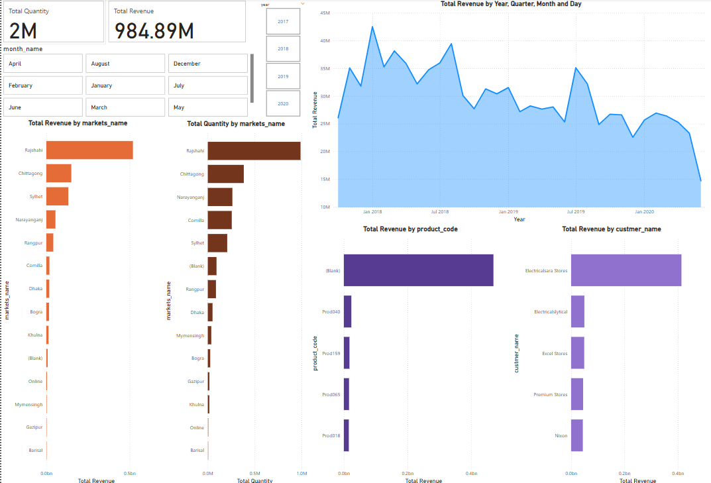

# 📊 Sales Insight Dashboard Project

Welcome to the **Sales Insight Dashboard** – a data analytics project designed to extract meaningful business insights from over **150,000+ sales records** using **SQL** and **Power BI**. This end-to-end project showcases data transformation, performance analysis, and dynamic dashboard reporting.

> 🚀 Created by **Nadim Srabon**, a passionate data analyst in the making.

---

## 🧰 Tools & Technologies Used

- 🛢️ **MySQL** – For data storage, cleaning, and transformation  
- 📈 **Power BI** – For data visualization and dynamic dashboarding  
- 📁 **Raw Data** – Over 150,000 rows of sales transactions  

---

---

## 🖥️ Dashboard Overview

**Key Features:**
- 📌 Total Sales: **984.89M**
- 🧮 Total Quantity Sold: **2M+**
- 📆 Time-based trends by **Year, Quarter, Month, Day**
- 🌍 Market-level revenue and quantity breakdown
- 📦 Product-wise performance analysis
- 🧑‍💼 Top revenue-generating customers

---

## 📌 Key Insights

- **Highest revenue** generated from the **Rajshahi** market  
- **Electricalsara Stores** is the top customer in terms of revenue  
- **Product010** is leading product in sales (among named items)  
- Seasonal peaks observed in **Q2 of 2018** and **early 2019**  

---

## 🧪 How to Use

1. 🔽 Clone or download this repository.
2. 🛢 Import `sales_insights_data.sql` into your MySQL server to restore the database.
3. 📊 Open the `.pbix` file in Power BI Desktop.
4. 🧠 Interact with filters (month, year) and visuals to explore trends.

---

## 👨‍💻 About Me

I'm **Nadim Srabon**, a data enthusiast currently pursuing CSE with a major in **Data Science** at East West University. I specialize in:
- Data Cleaning & Transformation
- Data Visualization
- SQL & Python-based Analysis
- Dashboard Design with Power BI

📫 **Let's Connect**:  
- LinkedIn: [linkedin.com/in/nadim-srabon](https://linkedin.com/in/nadim-srabon)
- GitHub: [github.com/nadim-srabon](https://github.com/nadim-srabon)

---

## 📌 Notes

> ⚠️ This project uses mock or anonymized data for demonstration purposes.  
> 🛡️ Make sure to **remove confidential information** before sharing the `.pbix` or `.sql` files publicly.

---

⭐ **If you liked this project, give it a star!**

